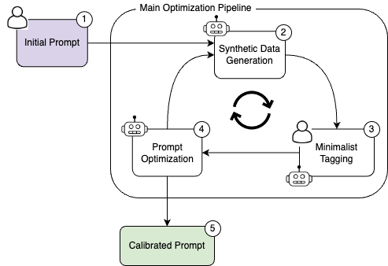

# AutoPrompt

AutoPrompt is an open-source flexible toolkit for optimizing prompts.
The proces is done via a calibration process in which:
1. An initial prompt and task description is provided by the user.
2. A set of challenging examples is suggested to the user
3. The samples are annotated (using human-in-the-loop or LLM)
4. The samples are evaluated using the current prompt
5. Evaluating the prompt score and extracting large error
6. Suggesting a new prompt
7. Repeat steps 2-6 until convergence

Each one of these components is independent and can be used separately. 

This work is an extension of 
[LARGE LANGUAGE MODELS AS OPTIMIZERS](https://arxiv.org/pdf/2309.03409.pdf) by Chengrun Yang et al. (2023).

## Learn More

* [Documentation](./docs/README.md)

## System Overview




## Installation

To install the required libraries, directly check `requirements.txt`.

To install using Conda:
```bash
> conda env create -f environment_dev.yaml
> conda activate AutoPrompt
```
#### Argilla setup
The human-in-the-loop annotation pipeline is based on [Argilla]('https://docs.argilla.io/en/latest/index.html').
For setting an Argilla server and UI follow the following [instructions](https://docs.argilla.io/en/latest/getting_started/quickstart_installation.html).
For quick installation we recommend to deploy Argilla on Hugging Face [space](https://huggingface.co/new-space?template=argilla/argilla-template-space).

## Usage
For a quick start (using Argilla estimator + OpenAI as the LLM model):
1. Run the Argilla server as described in previous section, and modify the estimator `api_url` in the config file accordingly.
2. Provide an OpenAI API key in the config file.
3. Define the `max_usage` in the config file according to the maximal budget for the optimization.
4. Run the following command:
```bash
> python run_pipeline.py
```
You will then be guided to provide the initial prompt and task description, and the optimization process will start.
You can track the optimization process using W&B dashboard.

### Classification
 * Use the `run_pipeline.py` to run classification jobs.

### Generation
 * Use the `run_generation_pipeline.py` to run generation jobs.
 * You need to use two separate config yaml files, one is the same as the classification config, and the other needs to have an empty estimator class. 

## Tips
## License

This toolkit is licensed under the [Apache License, Version 2.0](http://www.apache.org/licenses/LICENSE-2.0).