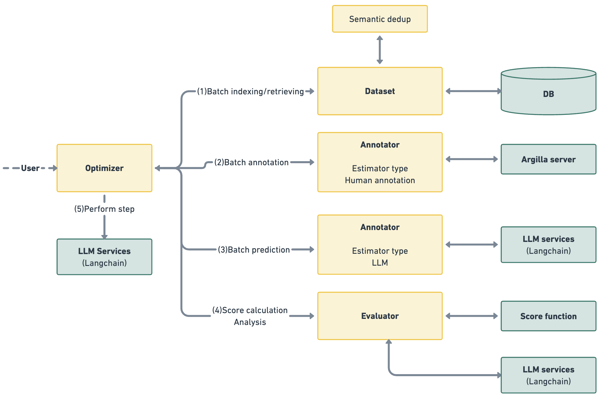

# Architecture Guide

This document outlines the system design of AutoPrompt, which is built around four primary components: Dataset, Estimator, Evaluator, and Optimizer Manager. These components collaborate to refine prompts through an iterative process involving sample generation, annotation, prediction, evaluation of scores, and optimization.

* __Dataset.__ This component manages the dataset and performs operations such as insertion, modification, deletion, and applying functions,  on the dataset rows. The component also handles data cleaning by removing semantic duplications and performing semantic sampling. Since the system is optimized for small datasets, the current implementation is based on a local database using [pandas](https://pandas.pydata.org).
* __Estimator.__ The estimator is responsible for estimating a batch of samples. We implement this component in two forms, once for the predictions and once for the annotations. Such a generic implementation (for both use cases) allows for easy adaptation of the system to diverse use cases, including  prompt calibration, prompt distillation and prompt squashing. The currently supported types of estimators are:
    1. __Human annotation__: Using [Argilla UI](https://docs.argilla.io/en/latest/index.html#). The system is connected to the Argilla server and is waiting until the annotation task is completed.
    2. __LLM estimator__: Using an LLM to estimate the sample given a prompt. We support various types of LLMs, using [Langchain](https://python.langchain.com/docs/get_started/introduction) integration. For efficiency, the system supports parallelism using both workers and async calls. The system also supports sending a few samples in one prompt (prompt batching), which can reduce the cost significantly.
    3. __Batch estimator__: The batch estimator runs multiple LLM estimators and adds a policy layer to aggregate the results. It is mainly used for prompt-squashing, aiming to optimize a single prompt that achieves the efficacy of multiple prompts. For example, in case of a user with several moderation rules.
* __Evaluator.__ The evaluator is responsible for evaluating the records after the prediction and annotation stage. The evaluator accepts a function and applies it to each row. It's important to note that the function is generic, for example in the generation pipeline the function is performed by invoking an LLM. The evaluator is also responsible for defining the errors and handling the error analysis using the Analyzer meta-prompt.
* __Optimizer manager (Optimization Pipeline).__ The optimizer manager handles the whole optimization process flow, it performs the iteration steps described in the system flow [documentation](how-it-works.md) and is responsible for stopping and returning the final calibrated prompt. The currently supported criteria are either convergence (determined by a patient hyper-parameter), or usage limit (determined by maximal cost if relevant, or by the number of generated tokens).

## Design Considerations

- **Modularity and Flexibility**: Each component is designed with modularity in mind, allowing for easy swaps or upgrades to accommodate different use cases.
- **Scalability**: The framework's architecture supports scaling, from handling small datasets efficiently to accommodating the computational demands of parallel processing and batch estimation.
- **Cost-Efficiency**: Features like prompt batching and the use of a batch estimator are specifically included to manage and minimize operational costs associated with LLM usage.
