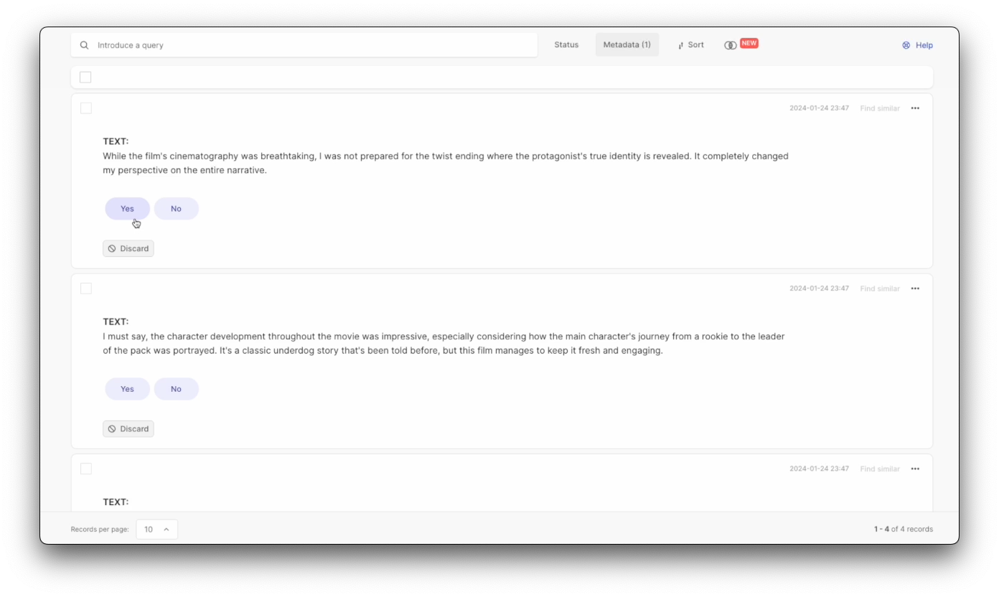

# Prompt Optimization Examples

This document provides practical examples of using the AutoPrompt pipeline across various scenarios. It focuses on movie review and chat moderation tasks to demonstrate the flexibility and effectiveness of the AutoPrompt framework.


1. [Filtering Movie Reviews with Spoilers (Classification task)](#filtering-movie-reviews-with-spoilers-i-task)
2. [Movie Genre Identification (Multi-label classification task)](#movie-genre-identification-multi-label-classification)
3. [Rating Movie Reviews (Scoring task)](#rating-movie-reviews-scoring-task)
4. [Generating Movie Reviews (Generation task)](#generating-movie-reviews-generation-task)
5. [Single Topic Moderation](#single-topic-moderation)
6. [Multi-Topic Moderation (Prompt squeezing task)](#multi-topic-moderation-prompt-squeezing)

### Filtering Movie Reviews with Spoilers (Classification task)

In this binary classification example, we aim to filter out movie reviews containing spoilers for a specific movie. A correctly implemented filter can be a powerful tool in a large-scale movie review system.

We'll start with a simple initial prompt and task description: 
 - Initial prompt: “Does this movie review contain a spoiler? answer Yes or No”<br>
 - Task description: “Assistant is an expert classifier that will classify a movie review, and let the user know if it contains a spoiler for the reviewed movie or not.”

#### Steps to Run Example

1. Configure your labels by editing `config/config_default.yml`. Modify the `label_schema` in the `dataset` section to include only 'Yes' and 'No' options.

```
dataset:
    name: 'dataset'
    records_path: null
    initial_dataset: 'dump/dataset.csv'
    label_schema: ["Yes", "No"]
    max_samples: 50
```
2. Run the main pipeline from an IDE or the command line
```bash
> python run_pipeline.py
```

*Note*: Without input parameters, the pipeline prompts the user to provide them. Alternatively, specify initial prompt and task description as command-line arguments:
```bash
> python run_pipeline.py \
    --prompt "Does this movie review contain a spoiler? answer Yes or No" \
    --task_description "Assistant is an expert classifier that will classify a movie review, and let the user know if it contains a spoiler for the reviewed movie or not."
```

3. A browser window displaying the Argilla workspace will open for manual annotations


Annotate the generated examples as they appear and monitor the pipeline's progress. Control the number of optimization iterations with the `num_steps` parameter, specified at start:
```bash
> python run_pipeline.py --num_steps 30
```
The pipeline concludes after reaching the `num_steps` or meeting a predefined stop criteria, defined in `config/config_default.yml`:
```
stop_criteria:
    max_usage: 0.5  # Max budget for optimization (USD for OpenAI's LLM model)
    patience: 3     # Number of iterations to wait for improvement
    min_delta: 0.05 # Minimum improvement between iterations
```
Note that the framework also supports using an LLM as the annotator, see setup instructions [here](installation.md#configure-llm-annotator).

4. After completion, the pipeline outputs a **refined (calibrated) prompt** tailored for the task and a reference **benchmark** with challenging samples. In this example, the final spoiler identification prompt might be:

```
Review Spoiler Identification Protocol: For the task of classifying IMDB reviews for
the presence of spoilers, the classifier must label reviews with a heightened sensitivity to
nuanced language and indirect spoiler cues. The classification labels are ’Yes’ for spoilers
and ’No’ for non-spoilers. Apply the following criteria rigorously: Label ’Yes’ if a review: -
Contains subtle references or nuanced language that hints at plot developments or character
arcs, without explicit detail. - Includes emotional responses or descriptive language that
indirectly reveals plot outcomes or twists. - Employs suggestive language that points to future
events or endings, even if it does not reveal specific information. Label ’No’ if a review: -
Discusses technical aspects, acting, direction, or personal viewer impressions in a manner
that does not hint at or reveal any plot details. - Comments on thematic elements, genre
characteristics, or storytelling techniques without disclosing or implying crucial plot twists.
```

- The framework automatically saves the benchmark, run log, and a checkpoint file (which stores the state of the optimization, enabling seamless continuation from a previous run) in a default `dump` path, adjustable with the `--output_dump` command line argument.
- Note that the steps above are relevant to all classification and generation tasks. See the following examples for more use cases. 

5. Until now, we've initiated the pipeline with just an initial prompt and task description. However, you can also include a few examples by specifying an initial dataset in the `initial_dataset` field within the `dataset` section of the `config/config_default.yml` file. For example:
```
dataset:
    initial_dataset: 'dump/dataset.csv'
```
An example of an initial dataset with two samples is shown below:
```
id,text,prediction,annotation,metadata,score,batch_id
0,"The cinematography was mesmerizing, especially during the scene where they finally reveal the mysterious room that captivated the main character.",No,Yes,,,0
1,"The director's bold choice to leave the world's fate unclear until the final frame will spark audience discussions.",No,Yes,,,0
```


### Movie Genre Identification (Multi-label classification):

In this example, we want to segment movie reviews into pre-defined genres. The initial prompt and task description might look like this: 
 - Initial prompt: "Based on the following movie review, what genre is this movie? Select between Action, Comedy, Drama, Romance or Horror."
 - Task description: "Assistant is an expert cinema critic for all genres, and is tasked with classifying other movie reviews."

#### Run Example
For this multi-label classification, update the `label_schema` in `config/config_default.yml`
```
dataset:
    label_schema: ["Action", "Comedy", "Drama", "Romance", "Horror"]
```
And then simply run the pipeline with the corresponding input parameters:
```bash
> python run_pipeline.py \
    --prompt "Based on the following movie review, what genre is this movie? Select between Action, Comedy, Drama, Romance or Horror." \
    --task_description "Assistant is an expert cinema critic for all genres, and is tasked with classifying other movie reviews."
```
Please follow the same annotation and monitoring procedures as shown in the previous example.

### Rating Movie Reviews (Scoring task):
In this example, we aim to score (rank) the movie reviews based on various criteria, assigning a numerical rating to each

We'll start with a simple initial prompt: 
 - Initial prompt: "How well is this movie review written? Give it a score between 1 and 5, with 1 being the lowest score."
 - Task description: "Assistant is an expert cinema reviewer and editor, and is tasked with scoring other movie reviews."

Note that although this task involves scoring, it is treated as a classification task, similar to the examples above.

#### Run Example
To run this task, update the `label_scheme` in the input `config/config_default.yml` config file:
```
dataset:
    label_schema: ["1", "2", "3", "4", "5"]
```
And then simply use the input parameters to run the pipeline:
```bash
> python run_pipeline.py \
    --prompt "How well is this movie review written? Give it a score between 1 and 5, with 1 being the lowest score." \
    --task_description "Assistant is an expert cinema reviewer and editor, and is tasked with scoring other movie reviews."
```
Follow the same steps as in the simple classification example for running the pipeline and annotating through the Argilla UI.

### Generating Movie Reviews (Generation task):
Here, we aim to generate good (insightful and comprehensive) movie reviews from scratch. The initial prompt might look something like this: 
 - Initial prompt: “Write a good and comprehensive movie review about a specific movie.”
 - Task description: “Assistant is a large language model that is tasked with writing movie reviews.”

This time, we'll need to use the `run_generation_pipeline.py` to initiate a generation run. This pipeline is different from but builds on the classification pipeline in our earlier examples.

The generation pipeline starts by taking the initial prompt and modifying it for a scoring task, similar to the scoring example above. Once it establishes a robust estimtor for high-quality content, in this instance movie reviews, it runs the generation pipeline without the need for human annotation. 

To facilitate this, two distinct input config files are employed: `config/config_diff/config_ranking.yml`, and `config/config_diff/config_generation.yml`.

Note that the `annotator` section in the generation config yaml file remains empty: 
```
annotator:
    method : ''
```

#### Run Example

Run the generation pipeline with appropriate arguments: 
```bash
> python run_generation_pipeline.py \
    --prompt "Write a good and comprehensive movie review about a specific movie." \
    --task_description "Assistant is a large language model that is tasked with writing movie reviews."
```

As the pipeline runs, the user will be prompted to annotate ranking examples of movie reviews. The final output will be a calibrated prompt for the generation task.

### Single Topic Moderation:

In this example, we aim to monitor user interactions on an Enterprise's chat platform to moderate (filter out) any unsolicited advertisements. This ensures a focused and relevant communication environment.

The initial prompt could be as follows:

- Initial prompt: “Assess whether the message contains advertising. Answer 'Yes' or 'No'.”
 - Task description: “As a moderation expert at FabricFantasia, an online store selling clothes, you meticulously review customer inquiries and support tickets.”

#### Run Example
For the moderation, update the `label_schema` in `config/config_default.yml`
```
dataset:
    label_schema: ["Yes", "No"]
```
And then execute the pipeline with the specified input parameters:
```bash
> python run_pipeline.py \
    --prompt "Assess whether the message contains advertising. Answer 'Yes' or 'No'." \
    --task_description "As a moderation expert at FabricFantasia, an online store selling clothes, you meticulously review customer inquiries and support tickets."
```
Please follow the same annotation and monitoring procedures as shown in the previous examples.

### Multi Topic Moderation (Prompt squeezing task):
In this example, our goal is to monitor user interactions on an enterprise's chat platform and moderate (filter out) any problematic topics, including disclosing personal information, deceptive practices, spam, illegal activities, conflict of interest, and off-topic content.

The initial prompt could be structured as follows:

- Initial prompt: “Does this message contain any problematic topics such as disclosing personal information, deceptive practices, spam, illegal activities, conflict of interest, or off-topic content? Respond with 'Yes' or 'No'.”
 - Task description: “As a moderation expert at FabricFantasia, an online store selling clothes, you meticulously review customer inquiries and support tickets.”


#### Run Example
In a multi-topic moderation setting, we use various moderation rules to annotate a sample. Each rule is evaluated independently, and the outcomes are combined to generate the final labels. We employ an LLM annotator to avoid time-intensive manual annotation.

This task utilizes two distinct input configuration files: `config/config_default.yml`, used previously, and `config/config_diff/config_batch_classification.yml`, which specifies the individual moderation rules, the policy for aggregating results, and LLM configuration. The available aggregation policies are 'exist', 'majority', and 'all'. The 'exist' and 'all' policies are suited for scenarios with 'Yes' or 'No' labels, while the 'majority' policy assigns the final label based on the most frequently occurring outcome across the rules.

In our case, it can look like this:
```
dataset:
    label_schema: ["Yes", "No"]

annotator:
    method : 'llm_batch'
    config:
        instructions: 
        ['Does the message disclosure sensitive personal information? Answer Yes or No', 
         'Does the message involve deceptive practices? Answer Yes or No',
         'Is this message an example of spam? Answer Yes or No',
         'Does the message reference or promote any illegal activities? Answer Yes or No',
         'Does the message come from someone with a potential conflict of interest? Answer Yes or No',
         'Is this message completely irrelevant to the services or products offered? Answer Yes or No'
         ]
        aggregation_mode: 'exist'  #'majority',  'exist', or 'all'. exist/all is working only in case label_schema: ["Yes", "No"]!
        estimator_config:
            num_workers: 2
            prompt: 'prompts/predictor/prediction.prompt'
            mode: 'annotation'
            mini_batch_size: 1
            llm:
              type: 'OpenAI'
              name: 'gpt-4-1106-preview'
```

Also, update the `label_schema` in `config/config_default.yml`
```
dataset:
    label_schema: ["Yes", "No"]
```

#### Run Example
As before, we'll use the `run_pipeline.py` to initiate a multi-topic moderation run.
```bash
> python run_pipeline.py \
    --batch_config_path "config/config_diff/config_batch_classification.yml" \
    --prompt "Assess whether the message contains any of the following problematic topics:  disclosing personal information, deceptive practices, spam, illegal activities, conflict of interest, off-topic content. Answer 'Yes' if it does or 'No' otherwise." \
    --task_description "As a moderation expert at FabricFantasia, an online store selling clothes, you meticulously review customer inquiries and support tickets."
```
Please follow the same annotation and monitoring procedures as shown in the previous examples.
